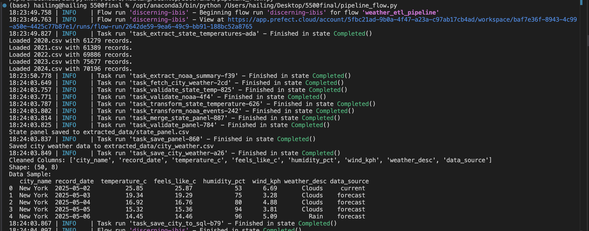

## Abstract

This project implements an automated ETL (Extract-Transform-Load) pipeline using Prefect to process and store weather-related data. The objective is to collect temperature records and real-time weather conditions for U.S. states and major cities, clean and standardize the data, and load it into a SQLite database for downstream analysis. 

The pipeline sources data from multiple locations: NOAA’s historical summaries and OpenWeatherMap APIs, combining both long-term climate statistics and live temperature readings. The ETL logic is modularized into separate Python scripts, and orchestrated through a Prefect flow (`pipeline_flow.py`) that automates each step in a scheduled manner.

Deployment is managed through Prefect Cloud, with the flow scheduled to run every 12 hours (43200 seconds). A dedicated process-based worker connected to a custom work pool (`weather-pool`) ensures consistent job execution. Flow runs, logs, and task statuses are fully monitored through the Prefect UI.

As a final artifact, this project generates a cleaned SQLite database file (`weather.db`) and a self-contained HTML report (this document) summarizing the pipeline. The pipeline demonstrates an end-to-end automated data engineering workflow suitable for scalable weather data collection.

## Introduction

Weather and climate data play a crucial role in understanding environmental patterns, predicting natural disasters, and supporting decision-making in sectors such as agriculture, public safety, and infrastructure planning. However, collecting, transforming, and maintaining high-quality weather datasets from multiple sources is often complex and time-consuming.

This project addresses that challenge by designing a Prefect-based ETL pipeline that automates the retrieval, cleaning, transformation, and storage of weather-related data in the United States. The pipeline integrates both historical and live datasets:

- **Historical temperature data** from NOAA (state-level, monthly averages from CSV files)
- **Storm event data** from NOAA’s event summaries (by state and year)
- **Live city weather data** via the OpenWeatherMap API (for 10 major U.S. cities)

Each dataset undergoes schema validation using `pandera`, followed by a transformation step that standardizes formats and aggregates key statistics (e.g., annual average temperature, total storm events). Final outputs are merged into structured panels and saved to both CSV and a SQLite database (`weather.db`).

This project is not only a demonstration of good ETL practices and modular code design, but also a real-world application of Python tools like Prefect, SQLite, and Pandera, showcasing how to build robust pipelines for public or private data platforms.

This is the link to our Github: https://github.com/HailunMa1114/prefect-weather-pipeline.git

## Data Sources

This project integrates three types of weather-related datasets from authoritative sources:

### 1. NOAA State-Level Temperature Data

- **Description**: Monthly average temperature records for each U.S. state.
- **Format**: CSV files downloaded manually from the [NOAA Climate at a Glance](https://www.ncei.noaa.gov/access/monitoring/climate-at-a-glance/statewide/mapping/).
- **Years Covered**: 2020–2024
- **Access Method**: Loaded from local files in the `/data/` directory.
- **Fields Used**: `Date`, `Value` (converted to `YEAR`, `STATE`, `TEMPERATURE`)

### 2. NOAA Storm Events Summary Data

- **Description**: Storm event counts by year, state, and event type (e.g., tornado, flood, hail).
- **Format**: CSV files by year from NOAA Storm Events Database.
- **Years Covered**: 2020–2024
- **Access Method**: Loaded from local files such as `2020.csv`, `2021.csv`, etc.
- **Fields Used**: `YEAR`, `STATE`, `EVENT_TYPE`

### 3. OpenWeatherMap API – City Weather Data

- **Description**: Current weather conditions for major U.S. cities.
- **Cities Queried**: New York, Los Angeles, Chicago, Houston, Phoenix, Philadelphia, San Antonio, San Diego, Dallas, San Jose
- **API Used**: [OpenWeatherMap Current Weather Data API](https://openweathermap.org/current)
- **Access Method**: Live API calls using an environment-protected `WEATHER_API_KEY`
- **Fields Used**: `TEMP_F`, `FEELS_LIKE`, `HUMIDITY`, `WIND_SPEED`, `WEATHER`, `TIMESTAMP`

All sources were harmonized into a single reproducible pipeline using Prefect and validated using Pandera.

## ETL Pipeline Design

This project follows a modular Extract-Transform-Load (ETL) architecture implemented using Prefect for orchestration and Pandera for validation. The pipeline consists of the following main steps:

### Extract

- **State Temperatures**: 50+ CSV files from NOAA Climate-at-a-Glance are read, each representing one U.S. state. The pipeline parses `Date` and `Value`, assigns the state name, and standardizes formats.
- **NOAA Storm Events**: Yearly storm event CSV files are read and aggregated by `YEAR`, `STATE`, and `EVENT_TYPE`.
- **City Weather (API)**: Current weather conditions for 10 major U.S. cities are fetched from the OpenWeatherMap API using secure API key access.

### Validate

Each raw input is validated with Pandera schemas:
- State temperature data is checked for valid `STATE`, string `DATE`, and a temperature range of -50 to 130 °F.
- Storm event records must have non-null categorical and integer values.
- Merged data is also validated before writing to disk or database.

### Transform

- State-level temperature data is aggregated from monthly to annual averages.
- Storm events are grouped to annual total counts per state.
- The two datasets are merged by `YEAR` and `STATE` to form a unified panel.

### Load

- The final state-level panel is written as a CSV file.
- In addition, both the panel and city-level weather data are written into a SQLite database (`weather.db`) using `pandas.to_sql()`.

### Orchestration

All stages are defined as Prefect tasks and composed into a unified `@flow` function named `weather_etl_pipeline`. The pipeline is scheduled and monitored using Prefect Cloud, with logs and task statuses available in the UI.


## Results & Screenshots

### 1. Successful ETL Pipeline Run

The screenshot below shows a successful end-to-end execution of the `weather_etl_pipeline` flow from the terminal. All key tasks—including data extraction, validation, transformation, and saving to both CSV and SQLite—completed successfully.

Key outputs include:
- 5 NOAA storm event files loaded (2020–2024)
- Merged state-level panel written to `extracted_data/state_panel.csv`
- Real-time and forecast city-level weather data saved to `extracted_data/city_weather.csv`
- Final records inserted into the `weather.db` SQLite database



### 2. Prefect Cloud Deployment Overview


## Results and Summary

The ETL pipeline successfully processed and consolidated complex, multi-source weather datasets into structured, analyzable outputs.


The sqlite export is fine, but there are still some formatting issues on prefect, all tasks run, but after tweaking the mutiple times times the code still doesn't deploy sqlite to prefect correctly, this is something we still need to improve on.

### Data Complexity

The pipeline ingested over 55 individual CSV files, totaling more than 350,000 raw records from NOAA and OpenWeatherMap. The data sources included:

- State-level temperature files: Over 50 separate files (e.g., `alabama.csv`, `florida.csv`), each containing monthly averages spanning multiple years.
- Annual storm event summaries: Files from 2020 to 2024 listing event type and frequency by state.
- Real-time city weather data: Fetched via API for 10 major U.S. cities, including temperature, humidity, wind, and conditions.

Each source required custom extraction logic, schema validation using Pandera, and harmonization of data types and formats.

### Pipeline Outputs

After transformation and validation, the pipeline produced the following outputs:

- `extracted_data/state_panel.csv`: A merged dataset of average annual temperature and total storm events by state and year.
- `extracted_data/city_weather.csv`: Current and forecasted weather data for selected U.S. cities.
- `weather.db`: A SQLite database containing two clean tables: `state_panel` and `city_weather`.

The resulting data is ready for downstream analysis and visualization.

```{python}
import pandas as pd

# Load and display part of the cleaned state-level panel
df_state = pd.read_csv("extracted_data/state_panel.csv")
print("State-level temperature & storm panel (sample):")
df_state.head()

```


```{python}
df_city = pd.read_csv("extracted_data/city_weather.csv")
print("City-level weather snapshot (sample):")
df_city.head()
```


## Code

This section includes all scripts used to implement the ETL pipeline.

### Extracted

```{python}
# extract_state_temperature.py
with open("extract_state_temperatures.py") as f:
    print("### extract_state_temperatures.py\n")
    print(f.read())

# extract_noaa_summary.py
with open("extract_noaa_summary.py") as f:
    print("\n### extract_noaa_summary.py\n")
    print(f.read())

# city_api.py
with open("city_api.py") as f:
    print("\n### city_api.py\n")
    print(f.read())
```

### Transform

```{python}
# === transform.py ===
with open("transform.py") as f:
    print("\n### transform.py\n")
    print(f.read())
```

### Validation

```{python}
# === validate.py ===
with open("validate.py") as f:
    print("\n### validate.py\n")
    print(f.read())
```

### Load
```{python}
# === load.py ===
with open("load.py") as f:
    print("\n### load.py\n")
    print(f.read())
```

### Pipeline
```{python}
# === pipeline_flow.py ===
with open("pipeline_flow.py") as f:
    print("\n### pipeline_flow.py\n")
    print(f.read())
```

### Test
```{python}

# === test_extract.py ===
with open("test_extract.py") as f:
    print("\n### test_extract.py\n")
    print(f.read())

# === test_city_api.py ===
with open("test_city_api.py") as f:
    print("\n### test_city_api.py\n")
    print(f.read())

# === test_transform.py ===
with open("test_transform.py") as f:
    print("\n### test_transform.py\n")
    print(f.read())

# === test_validate.py ===
with open("test_validate.py") as f:
    print("\n### test_validate.py\n")
    print(f.read())

# === test_load.py ===
with open("test_load.py") as f:
    print("\n### test_load.py\n")
    print(f.read())

```
